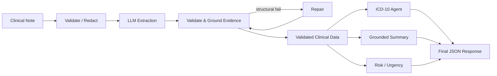

# MedExtract

> Clinical Note → Structured Medical Information + ICD-10 Candidate Codes

MedExtract turns an unstructured clinical note into a **validated, structured JSON
record** — chief complaint, symptoms, diagnoses, medical history, medications,
procedures, follow-up, a grounded summary, documentation-based risk/urgency, and
candidate ICD-10 codes. What sets it apart from a raw LLM call is **evidence
grounding and validation**: every extracted fact must be traceable to text in the
original note, and facts that can't be supported are dropped rather than trusted.

It is a **research/educational prototype** — not a diagnostic, triage, or
autonomous medical-coding tool.

---

## What MedExtract Does

**Input:** one free-text clinical note.
**Output:** a fixed-shape JSON object containing:

- `chief_complaint`
- `symptoms`, `diagnosis`, `medical_history`, `procedures`
- `medications` (name, dose, frequency, duration)
- `follow_up`
- `summary` (generated only from the validated data, not the raw note)
- `risk_indicators` and `urgency` (`low` / `medium` / `high`)
- `icd10_codes` (candidate codes, or abstention)

The key idea: **the LLM output is not trusted blindly.** After extraction, each
fact's supporting text is located in the note; unsupported facts are removed and
counted. Downstream stages (summary, risk, ICD-10) read only the *validated* data.

---

## Why MedExtract?

Clinical notes are unstructured, so the useful information is hard to process
automatically. A plain LLM call can extract fields — but it can also **invent
information** and suggest **unvalidated codes**. MedExtract addresses this by:

- grounding every fact to the source note (anti-hallucination),
- validating the LLM output against a strict schema with bounded repair, and
- treating ICD-10 codes as **suggestions with confidence**, not final coding.

---

## Key Features

**Information extraction**
- Structured extraction into a fixed JSON schema
- Evidence grounding of every fact against the source note (unsupported facts dropped)
- Schema validation with bounded, automatic repair on malformed output

**AI / LLM**
- Pluggable provider architecture (swap models without touching pipeline code)
- Hosted **OpenAI-compatible** API (e.g. **Groq / GPT-OSS**) — a real
  instruction-tuned model is required (no local or offline provider)
- Versioned prompts (V1 → V2 → V3 → Final) with a documented iteration rationale

**ICD-10 (bonus)**
- Bounded, tool-using agent (`search_codes`, `lookup_code`, `validate_code`, `get_category`)
- **Online-only lookup** via the NLM Clinical Table Search Service (ICD-10-CM) —
  no local code database and no offline fallback; if NLM is unreachable the agent
  abstains rather than serving canned data
- Procedures (ICD-10-PCS) abstain: there is no comparable free online PCS service
- Confidence-based **abstention** (`code: null`, `needs_review: true`) instead of guessing

**Safety**
- PHI/PII redaction utility + `/redact` endpoint; raw notes never logged
- Optional API-key auth, configurable CORS, request size limit, response disclaimer

---

## How It Works



Only the **validated** data flows to the summary, risk, and ICD-10 stages — they
never see the raw note (risk matches its lexicon against validated evidence).

---

## Architecture

| Layer | What it does | Location |
|---|---|---|
| **API** | FastAPI: `POST /extract` (flat), `POST /extract/rich` (evidence+status), `GET /health`, `POST /redact` | `src/medextract/api/` |
| **Orchestration** | Wires every stage and builds run metadata | `src/medextract/orchestrator.py` |
| **Extraction** | One LLM call with a versioned prompt (temperature 0) | `src/medextract/pipeline/extract.py`, `llm/` |
| **Validation & grounding** | Parse → Pydantic → locate each fact's evidence in the note | `src/medextract/pipeline/validate.py` |
| **Repair** | Bounded re-prompt on structural failure, else fail cleanly | `src/medextract/pipeline/repair.py` |
| **Summary & risk** | Grounded summary; deterministic lexicon-based risk/urgency | `src/medextract/pipeline/{summary,risk}.py` |
| **ICD-10** | Bounded agent + tools over the NLM online source (online-only, no local) | `src/medextract/icd10/` |
| **Safety** | Redaction, note validation, disclaimer | `src/medextract/safety.py` |
| **Output shaping** | Flatten internal model → the flat response schema | `src/medextract/brief.py` |
| **Frontend** | React UI: paste a note, see fields, meds, ICD-10, urgency, highlights | `frontend/` |

---

## Output Example

`POST /extract` returns the flat schema (evidence offsets are used internally for
grounding and are **not** included in the response):

```json
{
  "chief_complaint": "severe chest pain",
  "symptoms": ["severe chest pain", "shortness of breath", "fever"],
  "diagnosis": ["acute myocardial infarction"],
  "medical_history": ["hypertension"],
  "medications": [
    { "name": "amlodipine", "dose": "5 mg", "frequency": "daily", "duration": null }
  ],
  "procedures": [],
  "follow_up": "Follow up in 1 week",
  "summary": "Chief complaint: severe chest pain. Reported symptoms: ...",
  "risk_indicators": ["severe", "radiating"],
  "urgency": "high",
  "icd10_codes": [
    { "diagnosis": "acute myocardial infarction", "code": "I21.9",
      "description": "Acute myocardial infarction, unspecified",
      "confidence": 1.0, "needs_review": false }
  ]
}
```

Missing single values are `null`; missing lists are `[]`; the schema is identical
for every input.

---

## ICD-10 Agent

The ICD-10 agent runs **only on already-validated diagnosis terms** — it cannot
invent clinical facts. It resolves each term with bounded tool calls and records
how it got there.

```text
Validated Clinical Term
        ↓
   ICD-10 Agent   ── search_codes / lookup_code / validate_code / get_category
        ↓
   Candidate Code
        ↓
  Confidence Check   (bounded: 5 calls/term, 25/note; records resolution_path)
        ↓
Code Suggestion  ──or──  Abstention (code: null, needs_review: true)
```

It queries the live **NLM Clinical Table Search Service** (public US ICD-10-CM
API, no key) — **online-only, with no local database or offline fallback**. If
the service is unreachable, the agent abstains (`code: null`, `needs_review:
true`) rather than inventing or serving canned codes. This is **candidate coding
assistance for clinician review**, not final medical coding.

---

## Evidence Grounding

```text
LLM extraction → each fact →  ① locate evidence in the note (offsets)
                              ② check the evidence SUPPORTS the fact
                           → keep only facts that pass both
```

The system does not blindly trust the LLM, and grounding is **two steps**:

1. **Location** — the fact's `evidence` is located in the original note (exact
   match, then a `rapidfuzz` near-match fallback). Not found → dropped
   (`evidence_not_found`).
2. **Coherence** — locating the span is *necessary but not sufficient*. Evidence
   *"Patient reports cough."* is in the note, but it does not support a diagnosis
   of *"pneumonia"*. So the fact's content words must actually be covered by the
   evidence text; if they are not, the fact is **conservatively dropped**
   (`incoherent`) and counted in `incoherent_dropped`.

Together these are the honest signal of any remaining hallucination. Offsets and
status are computed internally: the **flat** `/extract` response returns the
extracted values only, while `/extract/rich` exposes the grounded evidence,
status, and ICD-10 audit trail for the UI.

> Honest limitation: lexical coverage cannot *prove* medical truth. It enforces a
> necessary condition and errs toward rejection, so genuine synonym/abbreviation
> mismatches (text "atrial fibrillation" vs evidence "afib") are dropped too.
> The grounding-robustness eval quantifies both the rejection and the recall cost.

---

## Technology Stack

| Layer | Technology |
|---|---|
| Language | Python 3.11+ |
| Backend | FastAPI + Uvicorn |
| Validation | Pydantic v2 |
| LLM provider | OpenAI-compatible API (Groq/GPT-OSS) — real LLM required |
| Fuzzy matching | RapidFuzz |
| ICD-10 lookup | NLM online API (online-only; no local fallback) |
| HTTP client | httpx |
| Frontend | React + TypeScript + Vite + Tailwind CSS |
| Testing | Pytest |

---

## Project Structure

```text
MEDExtract/
├── src/medextract/
│   ├── api/            # FastAPI app + routes
│   ├── pipeline/       # extract, validate, repair, summary, risk
│   ├── icd10/          # source (NLM online, no local fallback), tools, bounded agent
│   ├── llm/            # provider adapter: openai_compat (hosted GPT API)
│   ├── prompts/        # extraction_v1..final.md, repair.md, summary.md + CHANGELOG
│   ├── schemas.py      # Pydantic models (single source of truth)
│   ├── brief.py        # flatten internal model → flat response schema
│   ├── safety.py       # PHI redaction, validation, disclaimer
│   ├── orchestrator.py # wires the pipeline
│   ├── config.py       # env-driven settings
│   └── cli.py          # extract a note straight to a JSON file
├── frontend/           # React + TypeScript + Vite UI
├── eval/               # prepare_hf_dataset, run_eval, compare_prompts, metrics
├── tests/              # test suite mirroring the package
├── docs/               # SPEC.md (build contract) + approach.md (design rationale)
├── pyproject.toml
└── .env.example
```

---

## Installation & Quick Start

```bash
git clone <repository-url>
cd MEDExtract
python -m venv .venv
# Windows:  .venv\Scripts\activate     |  macOS/Linux:  source .venv/bin/activate
pip install -e .            # installs medextract (from src/) + dependencies
```

**Run the API** (serves `http://127.0.0.1:8000`, docs at `/docs`):

```bash
uvicorn medextract.api.app:app --reload
```

**Run the frontend** (needs the API running):

```bash
cd frontend
npm install
npm run dev                 # http://localhost:5173
```

**Extract a note to a JSON file** (CLI):

```bash
python -m medextract.cli --note "Severe chest pain. Hx hypertension." -o out.json
```

**Run tests:**

```bash
pytest
```

---

## LLM Configuration

The LLM provider is an adapter — configure it via environment variables (see
[.env.example](.env.example)). Never commit real keys. A real instruction-tuned
model is **required**; there is no offline heuristic provider. (The test suite
injects a mocked client, so `pytest` still runs with no network.)

**Groq (GPT-OSS) — OpenAI-compatible:**

```bash
MEDEXTRACT_LLM_PROVIDER=openai_compat
MEDEXTRACT_MODEL=openai/gpt-oss-20b        # or openai/gpt-oss-xb
MEDEXTRACT_LLM_BASE_URL=https://api.groq.com/openai/v1
MEDEXTRACT_LLM_API_KEY=...                 # your key
```


Other useful settings: `MEDEXTRACT_PROMPT_VERSION` (`v1|v2|v3|final`, default
`final`). ICD-10 coding is online-only (NLM); there is no local backend.

---

## Evaluation

The evaluation set is the real HuggingFace
[`chenhaodev/medical-dialogs-notes`](https://huggingface.co/datasets/chenhaodev/medical-dialogs-notes)
(225 real clinical notes) — **no synthetic/generated data**. Build it locally
(not committed; subject to that dataset's license):

```bash
python -m eval.prepare_hf_dataset          # -> eval/datasets/medical_dialogs_notes.jsonl
python -m eval.run_eval                     # single run -> eval/reports/
python -m eval.compare_prompts              # V1→V2→V3→Final comparison
```

Because these notes carry **no gold labels**, the harness reports the label-free
quality metrics — unsupported-/incoherent-extraction rate, schema first-pass
validity, repair rate, ICD-10 abstention rate, mean tool calls, and p50/p95
latency. Precision / recall / F1 require a labelled dataset.

Two further harnesses ship a labelled/curated set (see [eval/README.md](eval/README.md)):

```bash
# P/R/F1 on a 30-note, author-labelled subset (provenance-flagged, no PHI)
# needs a real LLM configured (see .env.example)
python -m eval.run_eval --dataset eval/datasets/labeled_mini.jsonl
# Anti-hallucination: rejection/retention of unsupported vs supported facts (offline)
python -m eval.grounding_eval
```

`grounding_eval` directly measures the fact↔evidence coherence gate (it feeds
crafted facts straight into `ground()`, no LLM); on the curated adversarial set
it rejects 100% of unsupported facts while retaining 100% of supported ones
(locked by `tests/test_grounding_eval.py`).

> Extraction and prompt-comparison runs require a real LLM. Results are written
> to `eval/reports/` when you run the commands above.

---

## Safety, Privacy & Limitations

Implemented protections:

- **PHI/PII redaction** utility and `POST /redact` endpoint
- Raw note text is **never logged** at INFO or above
- Optional **API-key authentication**, configurable **CORS**, and a request size cap
- A **disclaimer** is served at `GET /health` and shown in the UI

> **MedExtract is a research/educational prototype. It is not intended for
> clinical diagnosis, treatment, triage, or autonomous medical coding.** Risk and
> urgency are documentation-based (derived from language in the note) and are not
> a triage judgement. ICD-10 codes are candidate suggestions for clinician review.
> Grounding reduces but does not eliminate hallucination.

---

## Current Status

**Implemented**
- Full pipeline: extract → validate + **two-step evidence grounding (location +
  coherence)** → bounded repair → summary + risk + ICD-10
- Flat `/extract` (assignment schema) **and** `/extract/rich` (status + grounded
  evidence + ICD-10 resolution paths); FastAPI API; React frontend; CLI JSON export
- React UI shows fact → status → validated evidence, full ICD-10 provenance, a
  separate "Denied / ruled out" section, and **Save JSON** — negated / family-history
  facts never render as a positive diagnosis
- **Real-LLM-only** extraction: a hosted OpenAI-compatible API (Groq/GPT-OSS)
  provider adapter; prompts V1→Final. No local or offline provider — the test
  suite injects a mocked client instead
- **Online-only ICD-10** coding (NLM ICD-10-CM), no local database or fallback;
  confidence-based abstention; procedures abstain (no free online ICD-10-PCS)
- Grounding-robustness eval + 30-note labelled subset (P/R/F1) + prompt-comparison
  harness; hermetic test suite (127 tests, no network)

**In progress / partial**
- Prompt V1→Final comparison numbers (harness ready; needs a real-LLM run)
- Labelled evaluation is a small, author-constructed subset (P/R/F1 measured on
  controlled cases, not a claim of real-world clinical accuracy)
- Coherence gate is lexical (necessary-condition, conservative-reject); it cannot
  prove semantic medical truth and drops genuine synonym/abbreviation matches
- Procedures are left uncoded (ICD-10-PCS) — no free online PCS service

**Planned**
- Larger, independently-annotated evaluation set
- An online (or licensed) ICD-10-PCS source so procedures can be coded
- `mypy --strict` clean pass

---

## Future Improvements

- Run and publish the V1→Final prompt comparison on a real LLM
- Add a larger, independently-labelled evaluation subset
- Broaden ICD-10-PCS coverage beyond the curated common-procedure set

---

## Documentation

- [docs/approach.md](docs/approach.md) — design rationale and approach
- [src/medextract/prompts/CHANGELOG.md](src/medextract/prompts/CHANGELOG.md) — prompt V1→Final iteration and why Final is better

---

## Disclaimer

MedExtract is a research/educational prototype. It is **not** a medical device and
must **not** be used for diagnosis, treatment, triage, or autonomous coding. All
output is for clinician review.
